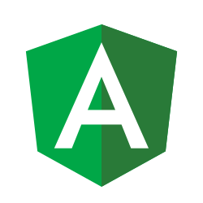

<h1 align="center">Design Angular Kit Lombardia</h1>

<p align="center">
  
  <br>
  <i>Design Angular Kit Lombardia è un toolkit basato su Bootstrap Lombardia 
    <br> per la creazione di applicazioni web sviluppate con Angular.</i>
  <br>
</p>

<p align="center">
  <a href="https://RegioneLombardia.github.io/design-angular-kit"><strong>regionelombardia.github.io/design-angular-kit</strong></a>
  <br>
</p>

<p align="center">
    <a href="https://www.npmjs.com/package/design-angular-kit-lombardia"></a>
</p>

<p align="center">
    <a href="https://github.com/RegioneLombardia/design-angular-kit/actions"></a>
<!--    <a href="https://codecov.io/gh/italia/design-angular-kit"></a> -->
    <a href="https://github.com/RegioneLombardia/design-angular-kit/blob/main/LICENSE"></a>
    <a href="https://github.com/RegioneLombardia/design-angular-kit/issues"></a>
</p>

<p align="center">
  <a href="https://github.com/semantic-release/semantic-release"></a>
  <a href="https://github.com/prettier/prettier"></a>
  <a href="https://github.com/eslint/eslint"></a>
</p>


## Intro

**Design Angular kit Lombardia** è una personalizzazione, per la Regione Lombardia, del [Design Angular kit Italia](https://italia.github.io/design-angular-kit/).

Analogamente al kit da cui deriva, è un set di componenti Angular che implementa [Bootstrap Lombardia](https://regionelombardia.github.io/bootstrap-lombardia/) e le [Linee Guida per il design e l’identità visiva digitale di Regione Lombardia](https://regionelombardia.github.io/bootstrap-lombardia/docs/it25/download/Linee-guida_design_identita-visiva_Regione-Lombardia.pdf).

## Come usare il kit

Design Angular Kit Lombardia è disponibile su NPM, per installarlo su una applicazione esistente sulla quale provare la libreria esegui il comando

```sh
npm install design-angular-kit-lombardia --save
```

Attualmente è allineata alla versione 1.4.0 del Design Angular kit Italia, quindi utilizza la versione 18 di Angular.  
Prima del rilascio della versione 1.0.0 effettiva, verrà allineata alla versione del Design Angular kit Italia più recente (al momento la 1.6.0 basata su Angular 20), purchè venga dichiarata "stabile".

## Configurazione
Per la configurazione si veda la [configurazione](https://github.com/italia/design-angular-kit?tab=readme-ov-file#configurazione) del Design Angular kit Italia.  
Naturalmente **sostituendo** di volta in volta le voci:
* `design-angular-kit` con `design-angular-kit-lombardia`
* `bootstrap-italia` con `bootstrap-lombardia`
* `italia.github.io` con `regionelombardia.github.io`
